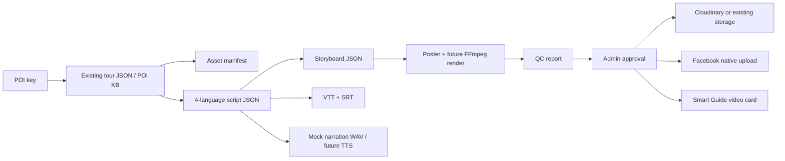

# ATOCKOREA Video Automation Architecture

Last updated: 2026-07-20

## Phase 0 Audit Summary

- Web app: Next.js 16, React 19, TypeScript, App Router.
- Mobile app: Expo 55, React Native 0.83, Capacitor bridge present at repo root.
- Database and auth: Supabase with service-role route handlers, RLS enabled on live tables.
- Existing Smart Guide room flow: `tour_rooms`, `tour_room_messages`, `tour_guide_spots`, `tour_room_spot_events`, `generated_spot_content`.
- Existing media flow: Supabase Storage buckets are used by admin upload and tour room attachments. Known buckets include `tour-images`, `tour-gallery`, `tour-videos`, `tour-audio`, and `tour-room-photos`.
- POI source data: centralized `data/poi_kb/poi_knowledge_base_v1.29.json`, static localized tour pages under `components/product-tour-static/*/*.json`, and stop-level content under `data/tour-stop-content`.
- Requested video skills are now installed from the user-provided GitHub sources: HyperFrames, video-use, selected Generative Media skills, Interflow Video Cut, and the local `atockorea-ai-video-workflow` orchestrator.
- FFmpeg `8.1.2` is installed through `winget`; the current Codex process may still need explicit `FFMPEG_PATH`/`FFPROBE_PATH` or an app/shell restart before bare `ffmpeg` resolves.

## Target Language Policy

The pilot defaults to exactly four subtitle and narration languages:

- `en`
- `zh-Hant` backed by existing `zh-TW` content where available
- `ja`
- `es`

Korean can remain an app UI/chat locale, but it is not part of the current video subtitle/narration deliverable unless explicitly added later.

## Recommended Architecture

1. `scripts/generate-poi-video.ts`
   - Reads POI text/image data from existing JSON assets.
   - Creates a deterministic dry-run output under `.tmp/video-automation`.
   - Emits script JSON, storyboard JSON, VTT/SRT, mock narration WAV, poster, QC, Facebook payload, and Smart Guide card payload.

2. `lib/video-automation/*`
   - Pure contracts for languages, asset manifest, script/storyboard, subtitles, app video card, publication payload, and QC.

3. Render and edit adapters
   - Use HyperFrames as the primary branded composition/render layer after `ffmpeg`/`ffprobe` and render dependencies are installed.
   - Use video-use for actual source footage analysis and B-roll editing after source clips are supplied.
   - Use Generative Media only for approved supporting graphics, thumbnails, or non-factual filler with provenance.
   - Use Video Cut/talking-head workflows only for guide, representative, interview, testimonial, FAQ, or other camera-facing footage.

4. Future persistence
   - Add non-destructive migrations for video project/renders/publications when admin approval UI starts.
   - Until then, dry-run artifacts and JSON contracts validate the flow without touching production data.

## Flow

## Current Limitation

Because video sources will be supplied later, the initial production media state is still `source_pending`. With explicit FFmpeg paths, the pilot can render poster-based placeholder MP4 files, but real MP4/HLS rendering still needs source footage, rights approval, and provider credentials.
